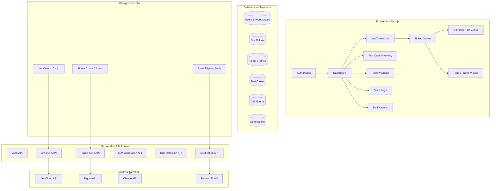

# Vouch — MVP v1 Implementation Plan

## What Vouch Is

Vouch is a **QA reconciliation layer** that sits between Jira, Figma, and your test suite. It:
1. Ingests Jira stories/bugs and Figma designs
2. Generates test cases from sparse AC + Figma frames using an LLM
3. **Detects drift** when Jira AC or Figma designs change after test cases were written
4. Flags stale test cases and stale bugs for review
5. Offers one-click auto-update of affected test cases

**28 stories · 121 story points · 8 epics · 8 weeks**

---

## User Review Required

> [!IMPORTANT]
> **Tech Stack Selection** — The choices below have significant implications for cost, speed, and scalability. Please review and confirm before I begin building.

> [!WARNING]
> **API Keys Needed** — Before development can produce a working product, you'll need:
> - Atlassian OAuth 2.0 (3LO) app credentials (for Jira Cloud)
> - Figma OAuth app credentials
> - LLM API key (OpenAI or Anthropic)
> - Supabase project (free tier)
> - Resend or Postmark API key (for email digest)

> [!IMPORTANT]
> **Scope Confirmation** — The PRD is 28 stories. Do you want me to build all 28 in sequence, or start with a specific subset (e.g., E1 + E2 + E4 first as a vertical slice)?

---

## Proposed Tech Stack

| Layer | Choice | Rationale |
|-------|--------|-----------|
| **Frontend** | Next.js 14 (App Router) | SSR + API routes in one repo, Vercel-native deployment |
| **Styling** | Tailwind CSS + shadcn/ui | Rapid, premium UI with accessible components |
| **Auth** | Supabase Auth (email/pw + Google SSO) | PRD-001 suggests Supabase or Clerk; Supabase gives us auth + DB in one |
| **Database** | Supabase (PostgreSQL) | Row-level security, realtime subscriptions, `pg_cron` for sync jobs |
| **Backend** | Next.js API routes + Supabase Edge Functions | API routes for UI, Edge Functions for cron/background jobs |
| **LLM** | Claude Sonnet 4.6 via Anthropic API | PRD suggests Claude or GPT-4.1; Claude for quality |
| **Email** | Resend | Modern, developer-friendly, free tier generous |
| **Hosting** | Vercel (free tier → Pro) | PRD explicitly recommends this; `vouch-app.vercel.app` |
| **OAuth** | Atlassian OAuth 2.0 (3LO) + Figma OAuth 2.0 | PRD-specified |

---

## Architecture Overview



---

## Database Schema (Core Tables)

```sql
-- Workspaces
workspaces (id, name, logo_url, created_by, created_at)

-- Users & membership
users (id, email, name, avatar_url, created_at)
workspace_members (workspace_id, user_id, role [owner|admin|member], invited_at, accepted_at)

-- Integration credentials (encrypted)
integrations (id, workspace_id, provider [jira|figma], access_token_enc, refresh_token_enc, account_email, connected_at, status)

-- Jira sync config
jira_sync_config (workspace_id, projects[], issue_types[], statuses[], sync_interval_min)

-- Jira tickets (versioned)
jira_tickets (id, workspace_id, jira_key, summary, description, ac_text, status, issue_type, labels[], links[], attachments[], figma_refs[], content_hash, synced_at, parent_story_id)

-- Figma frames (versioned snapshots)
figma_frames (id, workspace_id, file_key, node_id, frame_name, parsed_json, version_hash, figma_version, thumbnail_url, parsed_at)

-- Test cases (append-only, soft delete)
test_cases (id, workspace_id, title, preconditions, steps[], expected_result, test_type, priority, status [draft|active|review_needed|stale|archived], jira_story_id, jira_content_hash_at_author, figma_frame_ids[], figma_version_hashes_at_author[], authored_by, authored_at, deleted_at)

-- Drift events
drift_events (id, workspace_id, source_type [jira|figma], source_id, old_content_hash, new_content_hash, diff_summary, change_type [material|cosmetic], old_content, new_content, thumbnail_before, thumbnail_after, detected_at, action_taken, action_by, action_at)

-- Transcripts
transcripts (id, jira_ticket_id, filename, content, uploaded_by, uploaded_at, deleted_at)

-- Notifications
notifications (id, workspace_id, user_id, type, title, body, link, is_read, created_at)
```

---

## Proposed Changes — Epic by Epic

### E1: Account & Workspace (Week 1)

#### [NEW] `src/app/(auth)/login/page.tsx`
- Email/password login + Google SSO via Supabase Auth
- PRD-001: signup, email verification, password rules (10+ chars, 1 digit, 1 symbol)

#### [NEW] `src/app/(auth)/signup/page.tsx`
- Registration flow with email verification

#### [NEW] `src/app/(app)/onboarding/page.tsx`
- PRD-002: Create workspace (name + optional logo)
- PRD-003: Invite teammates (up to 5, magic link, Owner/Admin/Member roles)

#### [NEW] `src/app/(app)/settings/page.tsx`
- Workspace settings, member management, integration connections

---

### E2: Jira Integration (Weeks 1–2)

#### [NEW] `src/app/api/jira/oauth/route.ts`
- PRD-010: Atlassian OAuth 2.0 (3LO) flow
- Scopes: `read:jira-work`, `read:jira-user`
- Encrypted token storage

#### [NEW] `src/app/api/jira/sync/route.ts`
- PRD-011: Project/issue type selection UI
- PRD-012: Full ticket ingestion (paginated, content_hash, figma_refs extraction)
- 10-minute incremental re-sync via cron

#### [NEW] `src/app/(app)/tickets/page.tsx`
- PRD-013: Browsable ticket list with filters, search, drawer detail view

---

### E3: Figma Integration (Weeks 3–4)

#### [NEW] `src/app/api/figma/oauth/route.ts`
- PRD-020: Figma OAuth 2.0 (`file_read` scope)

#### [NEW] `src/lib/figma/parser.ts`
- PRD-021: Auto-discover Figma links from Jira tickets
- PRD-022: Parse Figma node tree → structured JSON (inputs, buttons, states, flows)
- 80% extraction accuracy target, async processing for large files

#### [NEW] `src/lib/figma/snapshots.ts`
- PRD-023: Versioned frame snapshots with content hash dedup, 90-day retention

---

### E4: Test Case Generation (Weeks 5–6)

#### [NEW] `src/app/(app)/tickets/[id]/generate/page.tsx`
- PRD-030: Link Jira story to Figma frames (checklist UI, manual paste, version binding)
- PRD-031: LLM-powered test case generation (positive/negative/edge/accessibility/flow cases)
- PRD-032: Transcript upload (drag-drop, .txt/.vtt/.srt/.md, ≤5 MB)

#### [NEW] `src/app/(app)/tickets/[id]/review/page.tsx`
- PRD-033: Review pane (Edit, Delete, Approve, Regenerate with feedback, bulk approve)
- PRD-034: Persist with source bindings (jira_content_hash_at_author, figma_version_hashes_at_author)

#### [NEW] `src/lib/llm/generate.ts`
- System prompt + context assembly for test case generation
- Output structure: title, preconditions, steps, expected result, test type, priority

---

### E5: Drift Detection (Weeks 7–8) — *The Differentiator*

#### [NEW] `src/lib/drift/jira-drift.ts`
- PRD-040: Compare content_hash on re-sync, fire JiraDriftEvent
- Material change heuristic (ignore whitespace/formatting, flag text changes)
- AI-generated one-sentence diff summary

#### [NEW] `src/lib/drift/figma-drift.ts`
- PRD-041: Structural diff of Figma frames (material vs cosmetic)
- Material = text/node/interaction/flow changes
- Cosmetic = color/spacing/typography (configurable)

#### [NEW] `src/app/(app)/review-queue/page.tsx`
- PRD-042: "Review Needed" badge, diff view (word-level for Jira, side-by-side for Figma)
- PRD-043: Workspace-wide review queue with filters, bulk actions, auto-refresh

#### [NEW] `src/lib/drift/auto-update.ts`
- PRD-044: One-click auto-update via LLM (targeted minimal update, not full rewrite)
- Side-by-side diff, Accept/Reject/Edit, bulk processing (10 parallel)

---

### E6: Stale Bug Detection (Week 8, if time)

#### [NEW] `src/lib/bugs/stale-detection.ts`
- PRD-050: Track parent story for each bug (via Jira links)
- PRD-051: Flag bugs when parent story materially changes
- PRD-052: Triage actions (Still relevant, Close in Jira, Convert to new bug)

#### [NEW] `src/app/(app)/stale-bugs/page.tsx`
- Stale bug candidates list with bulk actions

---

### E7: Dashboard & Inventory (Week 7)

#### [NEW] `src/app/(app)/dashboard/page.tsx`
- PRD-070: Four summary cards + recent activity feed
- Performance target: <1.5s load with 1000 tickets + 5000 test cases

#### [NEW] `src/app/(app)/test-cases/page.tsx`
- PRD-071: Full test case inventory with filters, search, CSV export, bulk actions

---

### E8: Notifications (Week 8)

#### [NEW] `src/components/notifications/bell.tsx`
- PRD-080: Bell icon + dropdown, last 30 events, deep links, mark read

#### [NEW] `src/lib/email/digest.ts`
- PRD-081: Daily email digest via Resend (configurable time, mutable, skips if empty)

---

## 8-Week Build Timeline

| Weeks | Focus | Stories | Milestone |
|-------|-------|---------|-----------|
| **1–2** | Foundation + Jira | PRD-001→003, PRD-010→013 | ✅ Users can sign up, connect Jira, and browse synced tickets |
| **3–4** | Figma + Linking | PRD-020→023, PRD-030 | ✅ Figma connected, frames parsed, linked to tickets |
| **5–6** | Generation + Review | PRD-031→034, PRD-071 | ✅ "Wow moment" — generate and approve test cases from any ticket |
| **7–8** | Drift + Dashboard + Notifications | PRD-040→044, PRD-070, PRD-080 | ✅ Full loop — drift detected, test cases auto-updated |
| **8** | Stretch | PRD-050→052, PRD-081 | ✅ Stale bugs + email digest (if time allows) |

---

## Open Questions

> [!IMPORTANT]
> **1. Tech Stack Confirmation** — Are you okay with Next.js + Supabase + Tailwind + shadcn/ui? Or do you have a preference for a different stack?

> [!IMPORTANT]
> **2. LLM Provider** — Claude Sonnet 4.6 or GPT-4.1? This affects API integration and cost.

> [!IMPORTANT]
> **3. Starting Scope** — Should I build all 8 epics in sequence, or start with a vertical slice (E1 + E2 + E4) to get a working demo faster?

> [!WARNING]
> **4. API Credentials** — Do you already have Atlassian and Figma OAuth app credentials, or do I need to guide you through setting those up first?

> [!IMPORTANT]
> **5. Styling Preference** — The PRD has a polished indigo design language already. Should I match the PRD's design system (indigo/slate palette, Inter font), or do you have a different brand identity in mind for the product?

---

## Verification Plan

### Automated Tests
- Unit tests for Figma parser, drift detection heuristics, content hashing
- Integration tests for Jira/Figma OAuth flows (mocked)
- E2E tests for critical flows: signup → connect Jira → generate test case → detect drift

### Manual Verification
- Deploy to Vercel, connect a real Jira project + Figma file
- Verify drift detection triggers correctly on AC/Figma changes
- Validate LLM generation quality on 10+ real tickets
- Performance test: dashboard load with 1000 tickets, 5000 test cases
