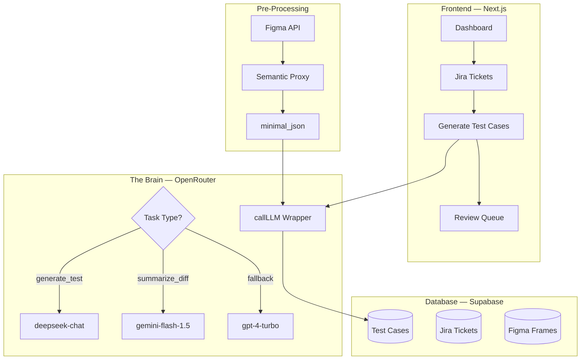

Here is the complete, updated documentation suite.

I have updated the **PRD**, **Implementation Plan**, and **Tasks Document** to reflect the **OpenRouter Strategy** (DeepSeek + Gemini Flash + GPT Fallback) and the **Cost-Optimization** logic (Semantic Proxy, Token Guards).

---

# 1. Product Requirement Document (PRD v1.2)
*Optimized for OpenRouter, DeepSeek, and Gemini Flash.*

```html
<!DOCTYPE html>
<html lang="en"><head><meta http-equiv="Content-Type" content="text/html; charset=UTF-8">
<title>Vouch — MVP v1.2 (Cost-Optimized)</title>
<meta name="viewport" content="width=device-width,initial-scale=1">
<style>
  *,*::before,*::after{box-sizing:border-box;margin:0;padding:0}
  :root{
    --teal:#0D9488;--teal-dark:#0F766E;--teal-soft:#CCFBF1;
    --slate-900:#0F172A;--slate-700:#334155;--slate-500:#64748B;
    --slate-50:#F8FAFC;--green:#059669;--green-soft:#D1FAE5;
    --amber:#D97706;--amber-soft:#FEF3C7;--red:#DC2626;--red-soft:#FEE2E2;
    --border:#E2E8F0;
  }
  body{font-family:'Inter',system-ui,sans-serif;background:var(--slate-50);color:var(--slate-900);line-height:1.6;font-size:15px;padding:48px 24px 120px;}
  .wrap{max-width:960px;margin:0 auto;background:#fff;border-radius:20px;box-shadow:0 1px 3px rgba(15,23,42,.04),0 8px 40px rgba(15,23,42,.06);overflow:hidden;}
  .cover{background:linear-gradient(135deg,#0D9488 0%,#0F766E 60%,#134E4A 100%);color:#fff;padding:56px 56px 48px;position:relative;overflow:hidden;}
  .cover-label{font-size:12px;letter-spacing:.14em;text-transform:uppercase;font-weight:600;color:#99F6E4;margin-bottom:16px;}
  .cover h1{font-size:42px;font-weight:800;letter-spacing:-.02em;line-height:1.1;margin-bottom:12px;}
  .cover p.sub{font-size:18px;color:#CCFBF1;max-width:640px;line-height:1.5;}
  .cover-meta{display:flex;gap:32px;margin-top:32px;flex-wrap:wrap;}
  .meta-item{font-size:13px;color:#5EEAD4}.meta-item b{display:block;color:#fff;font-size:14px;margin-top:2px;}
  
  section{padding:48px 56px;border-bottom:1px solid var(--border)}
  .eyebrow{font-size:12px;letter-spacing:.14em;text-transform:uppercase;font-weight:600;color:var(--teal);margin-bottom:8px}
  h2{font-size:24px;font-weight:700;letter-spacing:-.015em;margin-bottom:12px;}
  h3{font-size:18px;font-weight:700;margin:28px 0 12px;}
  p{margin-bottom:12px;color:var(--slate-700)} p.lead{font-size:16px;}
  ul{margin:0 0 16px 20px;} ul li{margin-bottom:6px;}
  
  table{width:100%;border-collapse:collapse;font-size:14px;margin-top:16px}
  th{text-align:left;padding:12px 14px;background:var(--slate-50);font-size:11px;letter-spacing:.08em;text-transform:uppercase;font-weight:600;border-bottom:1px solid var(--border)}
  td{padding:14px;border-bottom:1px solid var(--border);vertical-align:top}
  td.id{font-family:'JetBrains Mono',monospace;color:var(--teal);font-weight:600}
  td.num{text-align:center}
  
  .epic{margin-bottom:40px}
  .epic-header{display:flex;align-items:baseline;justify-content:space-between;gap:16px;padding-bottom:12px;border-bottom:2px solid var(--teal);margin-bottom:24px}
  .epic-title{font-size:20px;font-weight:700;}.epic-title .epic-code{font-family:'JetBrains Mono',monospace;color:var(--teal);font-weight:600;font-size:14px;margin-right:10px}
  
  .story{background:#fff;border:1px solid var(--border);border-radius:12px;padding:22px 24px;margin-bottom:16px;}
  .story-head{display:flex;align-items:flex-start;justify-content:space-between;gap:16px;margin-bottom:12px;flex-wrap:wrap}
  .story-id-title{display:flex;align-items:baseline;gap:10px;flex:1;min-width:0}
  .story-id{font-family:'JetBrains Mono',monospace;font-size:12px;font-weight:600;color:var(--teal);background:var(--teal-soft);padding:3px 8px;border-radius:4px;white-space:nowrap}
  .story-title{font-size:16px;font-weight:700;color:var(--slate-900);line-height:1.3}
  .badges{display:flex;gap:6px;flex-wrap:wrap}
  .badge{font-size:10px;letter-spacing:.08em;text-transform:uppercase;font-weight:600;padding:3px 8px;border-radius:4px;white-space:nowrap}
  .badge.must{background:var(--red-soft);color:var(--red)}
  .badge.should{background:var(--amber-soft);color:var(--amber)}
  .badge.cost{background:#CCFBF1;color:#0F766E;border:1px dashed #0D9488;}
  .badge.points{background:var(--teal-soft);color:var(--teal-dark);font-family:'JetBrains Mono',monospace}
  
  .story-narrative{background:var(--slate-50);border-radius:8px;padding:14px 16px;margin-bottom:14px;font-size:14px;line-height:1.6}
  .story-narrative b{color:var(--slate-900);font-weight:600}
  .ac-block{margin-top:12px}
  .ac-label{font-size:11px;letter-spacing:.1em;text-transform:uppercase;font-weight:600;color:var(--slate-500);margin-bottom:8px}
  .ac-list{list-style:none;margin:0;padding:0}.ac-list li{position:relative;padding:5px 0 5px 22px;font-size:14px;line-height:1.55}
  .ac-list li::before{content:"✓";position:absolute;left:0;top:5px;color:var(--green);font-weight:700}
  .story-footer{display:flex;gap:20px;flex-wrap:wrap;margin-top:14px;padding-top:12px;border-top:1px dashed var(--border);font-size:13px}
  .footer-item{color:var(--slate-500)}.footer-item b{color:var(--slate-700);font-weight:600;margin-right:4px}
  .footer-item code{font-family:'JetBrains Mono',monospace;font-size:12px;color:var(--teal-dark);background:var(--teal-soft);padding:1px 5px;border-radius:3px}
  .note{background:#FEF3C7;border-left:3px solid var(--amber);border-radius:0 6px 6px 0;padding:10px 14px;margin-top:12px;font-size:13px;color:#78350F}
  .cost-note{background:#CCFBF1;border-left:3px solid var(--teal);border-radius:0 6px 6px 0;padding:10px 14px;margin-top:12px;font-size:13px;color:#134E4A}
  .doc-footer{padding:32px 56px;background:var(--slate-50);color:var(--slate-500);font-size:13px;text-align:center}
</style>
</head>
<body>
<div class="wrap">
  <div class="cover">
    <div class="cover-label">Product Requirement Document · v1.2 (OpenRouter Optimized)</div>
    <h1>Vouch — MVP User Stories</h1>
    <p class="sub">The QA reconciliation layer. Cost-optimized via OpenRouter (DeepSeek + Gemini Flash).</p>
    <div class="cover-meta">
      <div class="meta-item">Owner<b>Shalini</b></div>
      <div class="meta-item">Version<b>MVP v1.2</b></div>
      <div class="meta-item">Status<b>Ready for build</b></div>
      <div class="meta-item">Timeline<b>8 weeks</b></div>
      <div class="meta-item">Total stories<b>29</b></div>
    </div>
  </div>

  <section>
    <div class="eyebrow">01 · Strategy</div>
    <h2>Cost Optimization via OpenRouter</h2>
    <p class="lead">We have updated the architecture to use <b>OpenRouter</b>. This allows us to route tasks to the cheapest model capable of doing the job, significantly reducing the burn rate from $2.00/gen to ~$0.10/gen.</p>
    <ul>
        <li><b>Test Generation (PRD-031):</b> Routed to <code>deepseek/deepseek-chat</code> (Cheap, excellent at JSON/Logic).</li>
        <li><b>Drift Summaries (PRD-040/041):</b> Routed to <code>google/gemini-flash-1.5</code> (Massive context, cheapest for text).</li>
        <li><b>Fallbacks:</b> If cheap models fail JSON validation, system falls back to <code>openai/gpt-4-turbo</code>.</li>
        <li><b>Payload Reduction:</b> Figma frames are stripped to "Semantic JSON" (PRD-022B) before sending to LLM.</li>
    </ul>
  </section>

  <section>
    <div class="eyebrow">02 · Epic Summary</div>
    <h2>Build at a glance</h2>
    <table>
      <thead><tr><th>Code</th><th>Epic</th><th class="num">Stories</th><th class="num">Points</th><th>LLM Strategy</th></tr></thead>
      <tbody>
        <tr><td class="id">E1</td><td>Account &amp; Workspace</td><td class="num">3</td><td class="num">7</td><td>None</td></tr>
        <tr><td class="id">E2</td><td>Jira Integration</td><td class="num">4</td><td class="num">16</td><td>None</td></tr>
        <tr><td class="id">E3</td><td>Figma + Semantic Proxy</td><td class="num">5</td><td class="num">22</td><td><b>Pre-process before LLM</b></td></tr>
        <tr><td class="id">E4</td><td>Test Case Generation</td><td class="num">5</td><td class="num">23</td><td><b>DeepSeek Primary</b></td></tr>
        <tr><td class="id">E5</td><td>Drift Detection</td><td class="num">5</td><td class="num">31</td><td><b>Gemini Flash (Summaries)</b></td></tr>
        <tr><td class="id">E6</td><td>Stale Bug Detection</td><td class="num">3</td><td class="num">12</td><td>Gemini Flash</td></tr>
        <tr><td class="id">E7</td><td>Dashboard &amp; Inventory</td><td class="num">2</td><td class="num">8</td><td>None</td></tr>
        <tr><td class="id">E8</td><td>Notifications</td><td class="num">2</td><td class="num">6</td><td>None</td></tr>
        <tr><td colspan="2"><b>Total</b></td><td class="num"><b>29</b></td><td class="num"><b>125</b></td><td>~8 weeks</td></tr>
      </tbody>
    </table>
  </section>

  <section>
    <div class="eyebrow">03 · User Stories</div>
    <h2>Key Updated Stories</h2>

    <div class="epic">
      <div class="epic-header">
        <div class="epic-title"><span class="epic-code">E3</span>Figma Integration (Cost-Optimized)</div>
        <div class="epic-meta">5 stories · 22 points</div>
      </div>

      <div class="story">
        <div class="story-head">
          <div class="story-id-title"><span class="story-id">PRD-022</span><span class="story-title">Parse Figma frames into Minimal Semantic Data</span></div>
          <div class="badges"><span class="badge must">Must</span><span class="badge cost">Cost-Saver</span><span class="badge points">8 pts</span></div>
        </div>
        <div class="story-narrative">
          <b>As</b> Vouch's test generator, <b>I need</b> a <b>minimal</b> representation of each Figma frame, <b>so that</b> the LLM input token count is reduced by ~80%.
        </div>
        <div class="ac-block">
          <div class="ac-label">Acceptance Criteria</div>
          <ul class="ac-list">
            <li>Fetch document tree via <code>GET /v1/files/:file_key</code>.</li>
            <li><b>STRIP:</b> Remove all coordinates (x,y), dimensions, vectors, and styling info.</li>
            <li><b>KEEP:</b> Node ID, Name, Type (Button/Input), Text Content, Component Properties (Variants), Image Refs.</li>
            <li>Store a <code>minimal_json</code>. Future LLM calls use this ONLY.</li>
          </ul>
        </div>
        <div class="cost-note"><b>Cost Impact:</b> Reduces 50k token payloads to ~2k tokens.</div>
      </div>

      <div class="story">
        <div class="story-head">
          <div class="story-id-title"><span class="story-id">PRD-022B</span><span class="story-title">New: Semantic Proxy Service</span></div>
          <div class="badges"><span class="badge must">Must</span><span class="badge cost">Cost-Saver</span><span class="badge points">4 pts</span></div>
        </div>
        <div class="story-narrative">
          <b>As a</b> Developer, <b>I want</b> a middleware service that converts raw JSON to "TestCase-Ready" format, <b>so that</b> we never send expensive metadata to the LLM.
        </div>
        <div class="ac-block">
          <div class="ac-label">Acceptance Criteria</div>
          <ul class="ac-list">
            <li>Create <code>figmaToSemanticModel(raw_json)</code> function.</li>
            <li>Output schema: <code>{ frame_name, elements: [{type, text, role, state}] }</code>.</li>
            <li>Unit tests proving 40k token input reduces to < 2k tokens.</li>
          </ul>
        </div>
      </div>
    </div>

    <div class="epic">
      <div class="epic-header">
        <div class="epic-title"><span class="epic-code">E4</span>Test Case Generation (Optimized)</div>
        <div class="epic-meta">5 stories · 23 points</div>
      </div>

      <div class="story">
        <div class="story-head">
          <div class="story-id-title"><span class="story-id">PRD-031</span><span class="story-title">Generate test cases (DeepSeek Routing)</span></div>
          <div class="badges"><span class="badge must">Must</span><span class="badge cost">Cost-Saver</span><span class="badge points">8 pts</span></div>
        </div>
        <div class="story-narrative">
          <b>As a</b> QA, <b>I want</b> Vouch to generate test cases using DeepSeek via OpenRouter, <b>so that</b> generation is 10x cheaper.
        </div>
        <div class="ac-block">
          <div class="ac-label">Acceptance Criteria</div>
          <ul class="ac-list">
            <li>System calls <code>callLLM({ taskType: 'generate_test', ... })</code> which routes to <code>deepseek/deepseek-chat</code>.</li>
            <li>Payload: Sparse AC + <code>minimal_json</code> (from PRD-022B).</li>
            <li><b>Token Guard:</b> If input > 8,000 tokens, reject and ask user to select fewer frames.</li>
            <li>System Prompt: "Output strict JSON. No markdown. No explanations."</li>
            <li><b>Fallback:</b> If JSON invalid, retry once. If fails again, use GPT-4-turbo via OpenRouter.</li>
          </ul>
        </div>
      </div>
      
      <div class="story">
        <div class="story-head">
          <div class="story-id-title"><span class="story-id">PRD-044</span><span class="story-title">One-click Auto-update (Delta Mode)</span></div>
          <div class="badges"><span class="badge must">Must</span><span class="badge cost">Cost-Saver</span><span class="badge points">5 pts</span></div>
        </div>
        <div class="story-narrative">
          <b>As a</b> QA, <b>I want</b> auto-update to only send the "Diff" to DeepSeek, <b>so that</b> updates cost $0.01 instead of $0.10.
        </div>
        <div class="ac-block">
          <div class="ac-label">Acceptance Criteria</div>
          <ul class="ac-list">
            <li>Send <b>Current Test Case</b> + <b>JSON Patch (Diff)</b> to DeepSeek.</li>
            <li><b>DO NOT</b> send the full Figma frame again.</li>
            <li>Prompt: "Update test case ONLY where the Diff indicates a change."</li>
          </ul>
        </div>
      </div>
    </div>

    <div class="epic">
      <div class="epic-header">
        <div class="epic-title"><span class="epic-code">E5</span>Drift Detection</div>
        <div class="epic-meta">5 stories · 31 points</div>
      </div>
      
      <div class="story">
        <div class="story-head">
          <div class="story-id-title"><span class="story-id">PRD-040</span><span class="story-title">Detect AC change & Summarize (Gemini)</span></div>
          <div class="badges"><span class="badge must">Must</span><span class="badge cost">Cost-Saver</span><span class="badge points">5 pts</span></div>
        </div>
        <div class="story-narrative">
          <b>As</b> Vouch's drift engine, <b>I need</b> to summarize Jira changes using Gemini Flash, <b>so that</b> summarizing text is nearly free.
        </div>
        <div class="ac-block">
          <div class="ac-label">Acceptance Criteria</div>
          <ul class="ac-list">
            <li>On hash mismatch, call <code>callLLM({ taskType: 'summarize_diff', ... })</code>.</li>
            <li>Routes to <code>google/gemini-flash-1.5</code>.</li>
            <li>Prompt: "Summarize the material differences between these two texts in one sentence for a QA engineer."</li>
          </ul>
        </div>
      </div>
    </div>
  </section>

  <div class="doc-footer">
    Vouch — Cost-Optimized MVP v1.2 · OpenRouter Strategy · Owner: Shalini
  </div>
</div>
</body></html>
```

---

# 2. Implementation Plan (v1.2)
*Focusing on the OpenRouter Wrapper and Semantic Proxy.*

```markdown
# Vouch — MVP v1 Implementation Plan (OpenRouter Optimized)

## What Vouch Is
Vouch is a **QA reconciliation layer** that detects when Jira/Figma changes make test cases stale. 
**28 stories · 125 points · 8 epics · 8 weeks**

---

## User Review Required

> [!IMPORTANT]
> **Tech Stack Selection** — Please confirm these choices:
> - **LLM Router:** OpenRouter.ai (DeepSeek / Gemini Flash / GPT-4 Fallback)
> - **Frontend:** Next.js 14 (App Router)
> - **Styling:** Tailwind CSS + shadcn/ui
> - **Auth/DB:** Supabase
> - **Email:** Resend
> - **Hosting:** Vercel

> [!WARNING]
> **API Keys Needed** — You need:
> 1. `OPENROUTER_API_KEY`
> 2. Atlassian OAuth Credentials
> 3. Figma OAuth Credentials
> 4. Supabase Project
> 5. Resend API Key

---

## Proposed Tech Stack

| Layer | Choice | Rationale |
|-------|--------|-----------|
| **LLM Abstraction** | `lib/llm.ts` (OpenRouter Wrapper) | Single entry point for DeepSeek/Gemini/GPT routing |
| **Frontend** | Next.js 14 (App Router) | SSR + API routes in one repo |
| **Styling** | Tailwind CSS + shadcn/ui | Rapid, premium UI (Matching PRD Teal theme) |
| **Auth** | Supabase Auth | PRD-001 spec, handles email/pw + Google SSO |
| **Database** | Supabase (PostgreSQL) | Stores `minimal_json`, `content_hash`, test cases |
| **Background Jobs** | Supabase Edge Functions + `pg_cron` | Jira polling (10m), Figma polling (6h) |
| **Email** | Resend | PRD-081 Daily Digest |

---

## Architecture Overview (Updated Flow)



---

## Database Schema Updates
*Added fields for Cost Optimization*

```sql
-- Figma Frames: Now stores minimal version for LLM
figma_frames (
  id, workspace_id, file_key, node_id, 
  parsed_json, -- Raw (for audit)
  minimal_json, -- Stripped (for LLM) <-- NEW
  version_hash, 
  created_at
)

-- Test Cases: No change, but generation logic changes
test_cases (...)

-- LLM Logs: NEW for debugging cost/failures
llm_logs (
  id, workspace_id, task_type, model_used, 
  input_tokens, output_tokens, cost_estimate, status, created_at
)
```

---

## Proposed Changes — Epic by Epic

### E1: Account & Workspace (Week 1)
*Unchanged, standard Supabase Auth setup.*

### E2: Jira Integration (Weeks 1–2)
*Unchanged, standard ingestion. `content_hash` is critical here.*

### E3: Figma Integration (Weeks 3–4) — **Cost Focus**
#### [NEW] `src/lib/figma/parser.ts`
- **PRD-022:** Parse Figma nodes.
- **PRD-022B (NEW):** Implement `toSemanticModel(raw)`.
  - *Strip:* x, y, rotation, fills, strokes.
  - *Keep:* id, name, type, characters, componentProperties.

#### [NEW] `src/lib/llm.ts` — **The Wrapper**
- **PRD-INF:** Implement the OpenRouter wrapper (logic provided in previous turn).
- Routing: `generate_test` -> `deepseek/deepseek-chat`.
- Routing: `summarize_diff` -> `google/gemini-flash-1.5`.
- Fallback logic: If DeepSeek JSON fails -> Retry -> GPT-4.

### E4: Test Case Generation (Weeks 5–6) — **Cost Focus**
#### [MODIFY] `src/app/api/generate/route.ts`
- **PRD-031:** 
  - Call `callLLM({ taskType: 'generate_test', ... })`.
  - Input: `minimal_json` (from E3) + AC Text.
  - **Token Guard:** Abort if payload > 8k tokens.
  - **JSON Mode:** Force `response_format: { type: "json_object" }`.

#### [MODIFY] `src/lib/drift/auto-update.ts`
- **PRD-044:**
  - Send only `CurrentTestCase` + `DiffPatch` to DeepSeek.
  - Do not re-send full Figma frame.

### E5: Drift Detection (Weeks 7–8) — **Cost Focus**
#### [MODIFY] `src/lib/drift/jira-drift.ts`
- **PRD-040:**
  - Detect hash change.
  - Call `callLLM({ taskType: 'summarize_diff', ... })` using **Gemini Flash** to generate the one-line summary.

---

## 8-Week Build Timeline

| Weeks | Focus | Key Tech | Milestone |
|-------|-------|----------|-----------|
| **1–2** | Foundation + Jira | Supabase, Jira API | ✅ Users can sign up, connect Jira |
| **3–4** | Figma + **Semantic Proxy** | Figma API, `toSemanticModel` | ✅ Figma connected, JSON stripped |
| **5–6** | **LLM Wrapper** + Generation | **OpenRouter, DeepSeek** | ✅ "Wow moment" — Cheap test generation |
| **7–8** | Drift + **Gemini Summaries** | **Gemini Flash** | ✅ Full loop — Cheap drift detection |
```

---

# 3. Build Tasks (Checklist)
*Ordered by dependency, highlighting the new "Cost" tasks.*

```markdown
# Vouch MVP v1.2 — Build Tasks

## Phase 1: Foundation
- [ ] Initialize Next.js 14 + Tailwind + shadcn/ui
- [ ] Setup Supabase Client & Environment Vars
- [ ] **Configure OpenRouter API Key**

## Phase 2: E1 — Account (PRD-001, 002, 003)
- [ ] Supabase Auth (Email/Pw + Google SSO)
- [ ] Workspace Creation & Onboarding
- [ ] Team Invites

## Phase 3: E2 — Jira (PRD-010, 011, 012, 013)
- [ ] Jira OAuth 2.0 Flow
- [ ] Ticket Ingestion (Store `content_hash`)
- [ ] Browsable Ticket List

## Phase 4: E3 — Figma (PRD-020, 021, 022, 022B, 023)
- [ ] Figma OAuth 2.0 Flow
- [ ] **NEW: Implement `figmaToSemanticModel` (Strip to minimal JSON)**
- [ ] Store `minimal_json` in DB
- [ ] Versioned Snapshots

## Phase 5: The Brain — LLM Wrapper (PRD-INF)
- [ ] **Create `lib/llm.ts`**
- [ ] Implement `callLLM` function
- [ ] Setup Routing: DeepSeek (Gen) / Gemini (Summary) / GPT (Fallback)
- [ ] Add JSON Validation & Retry Logic

## Phase 6: E4 — Generation (PRD-030, 031, 032, 033, 034)
- [ ] Link Jira to Figma Frames
- [ ] **Generate Test Cases via DeepSeek (using minimal_json)**
- [ ] Add 8k Token Guard
- [ ] Review/Approve UI
- [ ] Transcript Upload

## Phase 7: E5 — Drift (PRD-040, 041, 042, 043, 044)
- [ ] Jira Drift Detection (Hash check)
- [ ] **Summarize Drift via Gemini Flash**
- [ ] Figma Drift Detection (Compare `minimal_json`)
- [ ] Review Queue UI
- [ ] **Auto-Update (Delta Mode via DeepSeek)**

## Phase 8: E6, E7, E8 + Polish
- [ ] Stale Bug Detection
- [ ] Dashboard & Inventory
- [ ] In-App Notifications
- [ ] Email Digest (Resend)
- [ ] Deploy to Vercel
```